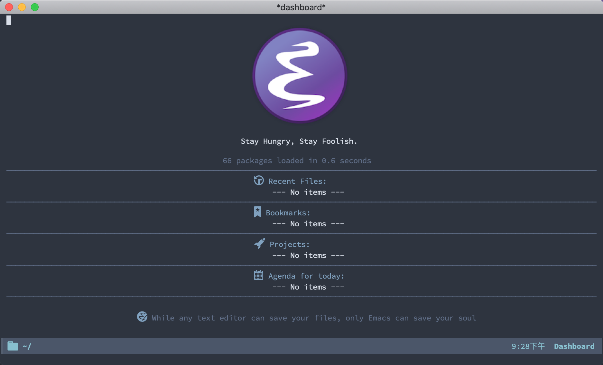

<p align="center"></p>

---

This is my emacs configuration, it's simple, but in terms of editing, I think
it's good enough. Of course, I will continue to improve it.

Configuration files list:
* [init.el](https://github.com/yunyanan/.emacs.d/blob/master/init.el):
Initialize configuration file.
* [config.org](https://github.com/yunyanan/.emacs.d/blob/master/config.org):
Main configuration file.

## Getting Started

Back up old configuration directory and clone this repository.

``` shell
mv ~/.emacs.d ~/.emacs.d.bak
git clone https://github.com/yunyanan/.emacs.d.git ~/.emacs.d
```

**NOTE:**
+ The [Source Code Pro](https://github.com/adobe-fonts/source-code-pro/releases)
  font is used in this configuration. You need to install this font on your computer first.

+ The following packages are used in the configuration, after emacs has
  installed all the required packages, run all the commands to complete
  the final installation.

  package|command
  -------|:------:
  [Doom-modeline](https://github.com/seagle0128/doom-modeline) | =M-x all-the-icons-install-fonts RTE=
  [Tab-nine](https://github.com/TommyX12/company-tabnine)| =M-x company-tabnine-install-binary= 

